

<h1 class="title">
 《移动互联网导论》期末报告
</h1>

曹智 09018123 
王宇 09018122 
廖盼 
陈曦 09018124 

 

题目：智能路由器开发配置

 
<h2 class="h2">
一、引言
</h2>

 

<h2 class="h2">
二、实验过程与分析
</h2>

---
<h3 class="h3">实验材料</h3>

<h3 class="h3">实验过程</h3>
<h4 class="h4">Openwrt刷机过程</h4>
<h5 class="h5">OpenWrt</h5>

OpenWrt 可以被描述为一个嵌入式的 Linux 发行版。（主流路由器固件有 dd-wrt,tomato,openwrt,padavan四类）对比一个单一的、静态的系统，OpenWrt的包管理提供了一个完全可写的文件系统，从应用程序供应商提供的选择和配置，并允许您自定义的设备，以适应任何应用程序。
对于开发人员，OpenWrt 是使用框架来构建应用程序，而无需建立一个完整的固件来支持；对于用户来说，这意味着其拥有完全定制的能力，可以用前所未有的方式使用该设备。
- 优势：
  - OpenWRT支持各种处理器架构，无论是对ARM，X86，PowerPC或者MIPS都有很好的支持。 其多达3000多种软件包，囊括从工具链(toolchain)，到内核(linux kernel)，到软件包(packages)，再到根文件系统(rootfs)整个体系，使得用户只需简单的一个make命令即可方便快速地定制一个具有特定功能的嵌入式系统来制作固件。
- 劣势:
  - 由于CPU内核体系不同，造成很多应用程序移植到OpenWrt上的时候经常崩溃。
  - 由于ADSL硬件模块的驱动程序没有开放源代码，造成很多ADSL一体无线路由的ADSL模块不能工作而造成功能缺失(RG100A和DB120除外)。
  - 由于OpenWRT并不是官方发布的路由器固件，所以要使用(刷入该固件)有困难，而且其基于Linux，导致OpenWRT的入门门槛较高。

对于Openwrt的劣势，我们在实验过程中有深入的体会。由于操作不当，我们不止一次进行了刷机重做。Openwrt的稳定性十分的不尽人意。
<h5 class="h5">安装CH340驱动程序</h5>

CH340 是一个USB 总线的转接芯片，实现USB 转串口、USB 转IrDA 红外或者USB 转打印口。 
在串口方式下，CH340 提供常用的MODEM联络信号，用于为计算机扩展异步串口，或者将普通的串口设备直接升级到USB 总线。
需要安装USB转TTL的芯片CH340的驱动装置才能通过USB驱动串口连接开发板。

<h5 class="h5">连接开发板</h5>

注意RX和TX不要接反，否则无法写入。
这里正确连接信号线与各个端口十分重要，否则可能会造成烧毁接口甚至毁坏开发版的惨剧。本实验组就烧毁了一个接口芯片，导致实验受到了不小的阻碍。
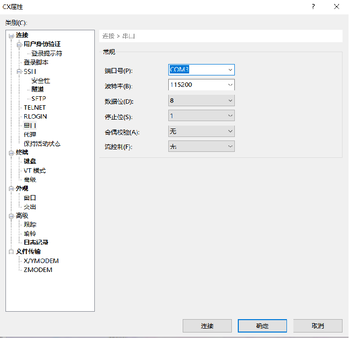
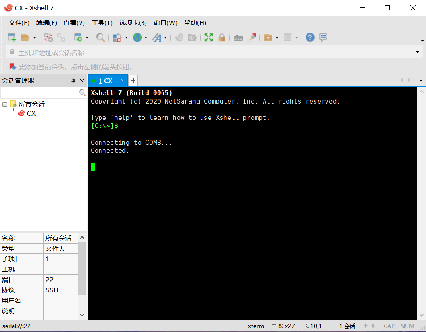

<h5 class="h5">启动TFTP服务</h5>

###### TFTP
- TFTP（Trivial File Transfer Protocol,简单文件传输协议）是TCP/IP协议族中的一个用来在客户机与服务器之间进行简单文件传输的协议。提供不复杂、开销不大的文件传输服务。
- TFTP是一个传输文件的简单协议，它基于UDP协议而实现，但是我们也不能确定有些TFTP协议是基于其它传输协议完成的。此协议设计的时候是进行小文件传输的。因此它不具备通常的FTP的许多功能，它只能从文件服务器上获得或写入文件，不能列出目录，不进行认证，它传输8位数据。传输中有三种模式：netascii，这是8位的ASCII码形式，另一种是octet，这是8位源数据类型；最后一种mail已经不再支持，它将返回的数据直接返回给用户而不是保存为文件。

###### 在windows中开启该服务

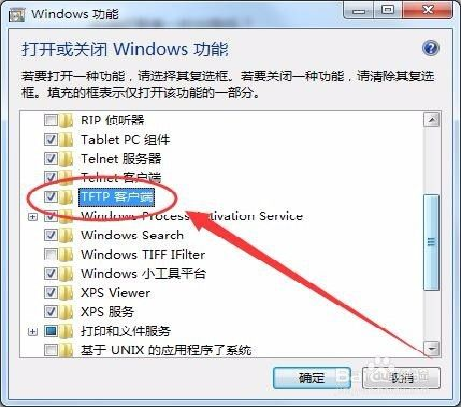

###### 手动设置IP地址
手动设置IP地址，连接开发板和电脑
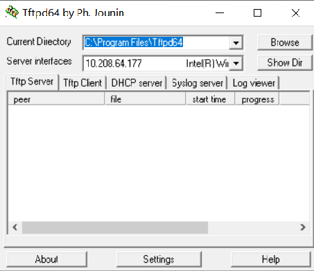

<h5 class="h5">U-boot刷机</h5>

###### U-boot
- Das U-Boot 是一个主要用于嵌入式系统的引导加载程序，可以支持多种不同的计算机系统结构，包括PPC、ARM、AVR32、MIPS、x86、68k、Nios与MicroBlaze。这也是一套在GNU通用公共许可证之下发布的自由软件。
- 其有许多优点：
  - 开放源码；
  - 支持多种嵌入式操作系统内核，如Linux、NetBSD, VxWorks, QNX, RTEMS, ARTOS, LynxOS, android；
  - 支持多个处理器系列，如PowerPC、ARM、x86、MIPS；
  - 较高的可靠性和稳定性；
  - 高度灵活的功能设置，适合U-Boot调试、操作系统不同引导要求、产品发布等；
  - 丰富的设备驱动源码，如串口、以太网、SDRAM、FLASH、LCD、NVRAM、EEPROM、RTC、键盘等；
  - 较为丰富的开发调试文档与强大的网络技术支持；
- U-Boot可支持的主要功能:
  - 系统引导支持NFS挂载、RAMDISK(压缩或非压缩)形式的根文件系统；支持NFS挂载、从FLASH中引导压缩或非压缩系统内核；
  * 基本辅助功能强大的操作系统接口功能；可灵活设置、传递多个关键参数给操作系统，适合系统在不同开发阶段的调试要求与产品发布，尤以Linux支持最为强劲；支持目标板环境参数多种存储方式，如FLASH、NVRAM、EEPROM；
  * CRC32校验可校验FLASH中内核、RAMDISK镜像文件是否完好；
  * 设备驱动串口、SDRAM、FLASH、以太网、LCD、NVRAM、EEPROM、键盘、USB、PCMCIA、PCI、RTC等驱动支持；
  * 上电自检功能SDRAM、FLASH大小自动检测；SDRAM故障检测；CPU型号；
  * 特殊功能XIP内核引导；

###### 刷机
- 进入U-boot界面后，先将固件通过TFTP传入开发板中，再按照刷机指令进行刷机
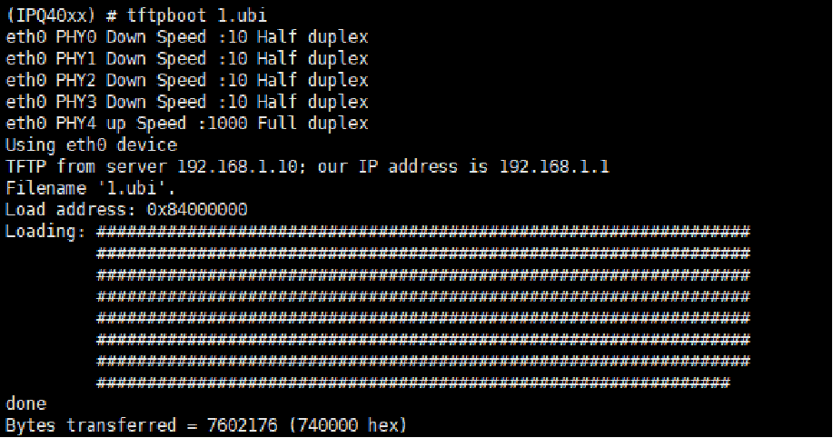

出现如图所示的界面就表示刷机成功了。
刷机是我们本次实验中十分重要的一环，也是我们花费时间最多的一环。因为开发版和系统的稳定性都十分有限，一个不经意的小错误可能会导致无法解决的错误。只好重新刷机，全部重做。另外一点就是如果刷机的时候某些参数配置错误的话，即使刷机成功，后续实验也会受到影响。总之，在这一问题上我们耗费李十分多的精力。

<h4 class="h4">Luci安装</h4>
Luci是 Lua ConfigurationInterface的简称，意在OpenWrt整个系统的配置集中化。
OpenWrt的所有配置文件皆位于/etc/config/目录下。每个文件大致与它所配置的那部分系统相关。可用文本编辑器、"uci" 命令行实用程序或各种编程API(比如 Shell, Lua and C)来编辑/修改这些配置文件。
UCI是Unified Configuration Interface的缩写，翻译成中文就是统一配置接口，用途就是为OpenWrt提供一个集中控制的接口。OpenWrt实现的这个工具，能够让你的不管是Lua还是PHP程序，或者SHELL程序或C程序，只要执行命令传输参数就能达到修改系统参数的目的，请参考本文后面的命令行实用工具。
系统的配置应该简单直接，UCI的设计初衷即是这样的，它是NVRAM-based配置方法的继承者（基于NVRAM的配置方法起源于OpenWrt的White Russian系列，该版本目前不再更新，最后发布于2007年，版本号为0.9）。UCI可以视为OpenWrt系统功能设置的主要用户配置接口，通常来说这些配置与系统的功能关联性较大，想像一样我们平常所使用的路由器或嵌入式设备中的WEB界面中的那些配置项，就是路由器或嵌入式设备系统所集成了的功能。常见的例子如路由器的网络接口设置，无线参数设置，logging设置和远程登录设置等。

<h5 class="h5">配置网络设置</h5>

- 此时openwrt没有图形化界面
- 需要修改 /etc/config/network 配置
- 添加 wan 口，使其可以接入互联网
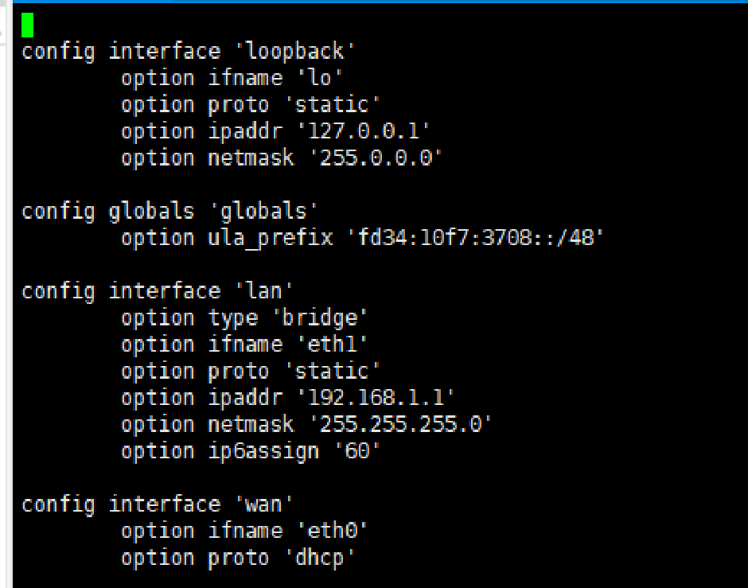

<h5 class="h5">固件更新</h5>

- 不进行固件更新的话，luci安装可能会失败
- 先下载最新的固件
- 再使用sysupgrade更新
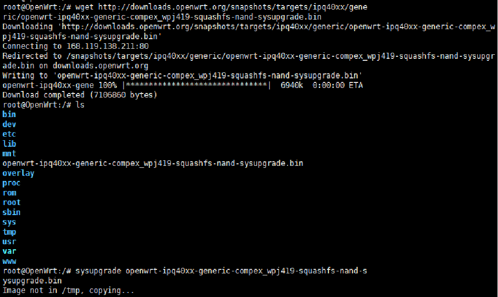

<h5 class="h5">安装</h5>

- 使用opkg安装 luci
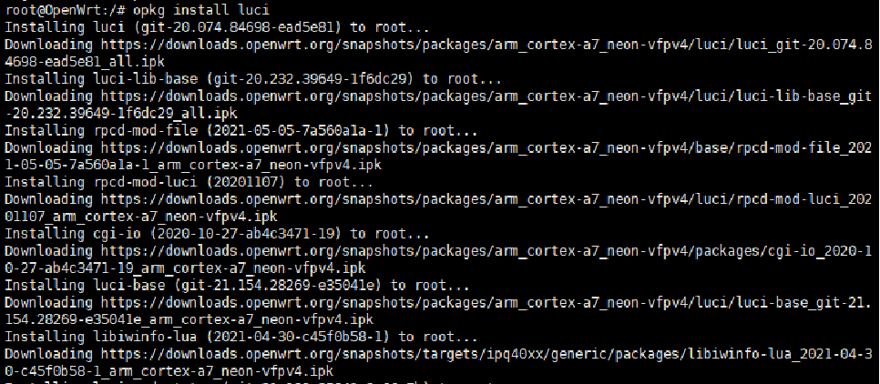

<h5 class="h5">启动luci</h5>

- /etc/init.d/uhttpd enable   将uhttpd加入开机启动
- /etc/init.d/uhttpd start    启动uhttpd服务
此时既可以在浏览器中进行路由器配置。

- 打开 http://192.168.1.1 
  - 192.168.1.1属于IP地址的C类地址，属于保留IP，专门用于路由器设置。

<h4 class="h4">路由器配置</h4>

<h5 class="h5">接入校园网</h5>

- 这里可以选择将网线插入路由器连接入网，同时也可以使用路由器的两个端口进行一收一发的行为，实现中继器的功能。但是这里并不是一个简单的物理层的无线中继器，而是多了更多应用层的内容。多了更多的配置选项。
- 在wireless界面
- 让一个网口接入校园网
- 另一个网口当作AP
- 实现无线中继器

<h4 class="h4">Iperf3测速</h4>
<h5 class="h5">Iperf3</h5>

iperf3是一个网络速度测试工具，支持IPv4与IPv6，支持TCP、UDP、SCTP传输协议，可在Windows、Mac OS X、Linux、FreeBSD等各种平台使用，是一个简单又实用的小工具。

<h5 class="h5">Iperf3安装</h5>

- 在openwrt中使用opkg安装 Iperf3

- 在手机上安装可以使用Iperf3的软件
（例如 Network Tools）

<h5 class="h5">监听</h5>

- 在 openwrt 上使用 iperf3 -s 开启监听

<h5 class="h5">测速</h5>

- 在手机上使用 iperf3 -c 192.168.1.1进行测速

<h4 class="h4">修改luci界面</h4>

<h5 class="h5">LuCI 基础</h5>

Controller 位于： /usr/lib/lua/luci/controller/ 下——定义模块的入口
Model 位于： /usr/lib/lua/luci/model/cbi/ 下——配置模块实际的代码

<h5 class="h5">第一步：定义模块入口：</h5>

控制器名/路径：
       不带路径的控制器名默认存在于/usr/lib/lua/luci/controller/下，否则以controller/为根目录
entry表示添加一个新的模块入口，官方给出了entry的定义，其中后两项都是可以为空的：
entry(path, target, title=nil, order=nil)

path：
      如果这样写{“click”, “here”, “now”}，那么就可以在浏览器里访问“http://192.168.x.1/cgi-bin/luci/click/here/now”来访问这个脚本。我们也可以根据需要按如下方式编写{“admin”, “一级菜单名”, “菜单项名”}，系统会自动在对应的菜单中生成菜单项。比如想在“网络”菜单下创建一个菜单项，那么一级菜单名可以写为“network”。
target：
      调用目标分为三种，分别是执行指定方法Action、访问指定页面Views以及调用CBI Module
第一种可以直接调用指定的函数，比如点击菜单项就直接重启路由器等等，比如写为call(“function_name”)，然后在lua文件下编写名为function_name的函数就可以调用了。
第二种可以访问指定的页面，比如写为template(“myapp/mymodule”)就可以调用/usr/lib/lua/luci/view/myapp/mymodule.htm文件了
而如果要编写配置页面，那么使用第三种方法无非是最方便的，比如写为cbi(“myapp/mymodule”)就可以调用/usr/lib/lua/luci/model/cbi/myapp/mymodule.lua文件了。
title和order:
module("luci.controller.LuoYeLuCI", package.seeall)
function index()
        entry({"admin", "network", "LuoYeconfig"}, cbi("LuoYeCBI"), _("LuoYeTest"), 100)
end

<h5 class="h5">第二步：配置CBI Module<h5>

###### 首先要需要映射与存储文件的关系
m = Map("配置文件文件名", "配置页面标题", "配置页面说明")

第一个参数即为配置文件存储的文件名，不包含路径.
第二与第三个参数则是用在来页面上显示的
 
###### 接下来需要创建与配置文件中对应的Section
Section分为两种，NamedSection和TypedSection，前者根据配置文件中的Section名，而后者根据配置文件中的Section类型 

###### 创建配置文件
文件需要存储在/etc/config（如果配置文件不存在的话，访问配置页面将会报错）
内容格式如下：
config login
    option username ''
    option password ''
    option ifname 'eth0'
    option domain ''

<h5 class="h5">LuCI 页面修改<h5>

简单的文件配置，路由上路径主要是/usr/lib/lua/luci/下子目录：/controller/ 、/model/cbi/ 、 /view/，或者根目录下的/www/中.可以在路上修改查看效果.
要编译自定义LuCI页面的固件，修改如下OpenWRT源码结构路径内的LuCI文件.

<h5 class="h5">需求分析<h5>

在使用OpenWrt路由器的过程中，经常需要根据需要改改配置文件然后重新启动服务什么的，一般的做法是登录路由器后台，使用vi编辑器修改文件，然后使用/etc/init.d/xxxx restart 来重启服务，次数多了就会觉得很繁琐，所以我们考虑自己写一个luci界面在路由器web后台修改配置文件。

<h5 class="h5">过程<h5>

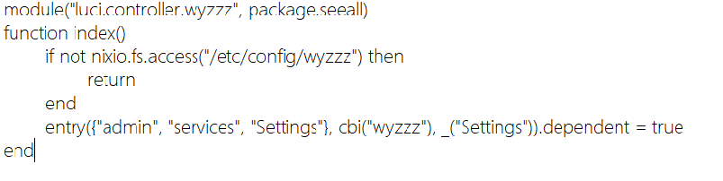
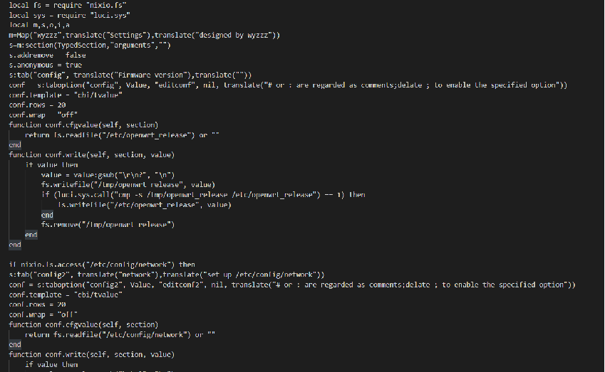
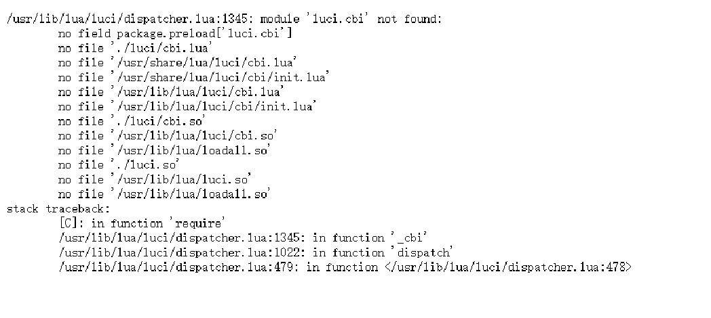

<h5 class="h5">成果<h5>

- 修改network相关配置
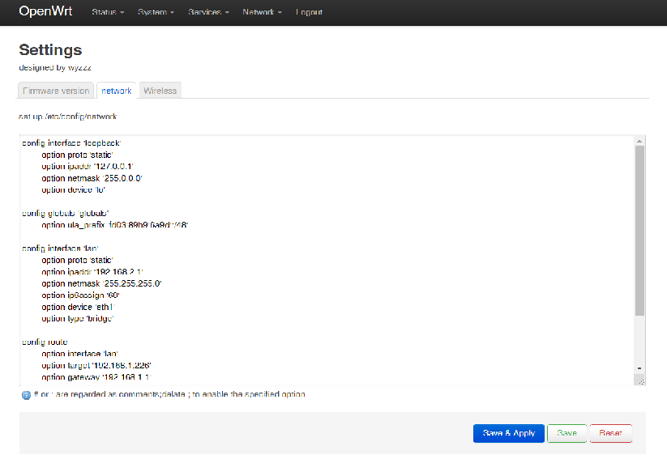
- 修改wireless相关配置

<h3 class="h3">实验分析</h3>

 

<h2 class="h2">
三、实验总结
</h2>

---

